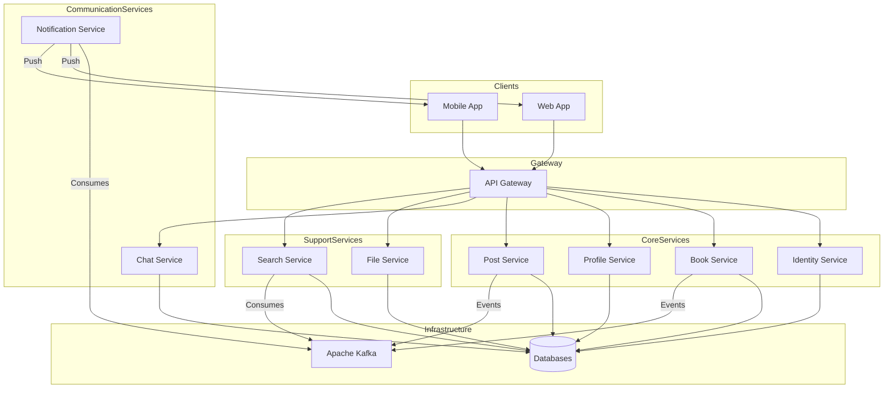

# Bookteria Microservice Architecture Analysis

## Overview

Bookteria is a book-focused social network application built using a microservices architecture. The system decomposes functionality into multiple independently deployable services, each responsible for specific business domains.

## Microservices Breakdown

Based on the repository structure, the following microservices are identified:

### Core Services

1. **API Gateway** (`api-gateway`)
   - Single entry point for all client requests
   - Routes requests to appropriate microservices
   - Handles cross-cutting concerns (authentication, rate limiting, load balancing)

2. **Identity Service** (`identity-service`)
   - User authentication and authorization
   - JWT token management
   - User registration and login
   - Role-based access control (RBAC)

3. **Book Service** (`book-service`)
   - Book catalog management
   - Book metadata and information
   - Book search and filtering

4. **Profile Service** (`profile-service`)
   - User profile management
   - User preferences and settings
   - User statistics and activity

5. **Post Service** (`post-service`)
   - User-generated content (posts, comments)
   - Social interactions (likes, shares)
   - Content moderation

6. **Chat Service** (`chat-service`)
   - Real-time messaging between users
   - Chat rooms and conversations
   - Message history

7. **File Service** (`file-service`)
   - File upload and storage
   - Image processing
   - File retrieval and serving

8. **Notification Service** (`notification-service`)
   - Push notifications
   - Email notifications
   - In-app notifications
   - Notification preferences

9. **Search Service** (`search-service`)
   - Full-text search capabilities
   - Search indexing
   - Search result ranking

### Client Applications

10. **Web App** (`web-app`)
    - React/JavaScript frontend application
    - Web-based user interface

11. **Mobile App** (`mobile-app`)
    - Mobile application (iOS/Android)
    - Native or cross-platform implementation

## Technology Stack

- **Backend**: Java (80.2%) - Spring Boot microservices
- **Frontend**: JavaScript (19.4%) - React for web app
- **Message Broker**: Apache Kafka (for asynchronous communication)
- **Containerization**: Docker (docker-compose.yml present)
- **API Documentation**: Postman collection available

## Architecture Patterns

### Communication Patterns

1. **Synchronous Communication**
   - REST APIs for request-response patterns
   - API Gateway routes requests to services
   - Service-to-service REST calls

2. **Asynchronous Communication**
   - Apache Kafka for event-driven communication
   - Event sourcing for state changes
   - Pub/Sub pattern for notifications

### Service Communication Flow

```
Client → API Gateway → Microservice → (Kafka) → Other Microservices
```

## Architecture Diagram



## Data Flow Examples

### User Registration Flow
1. Client → API Gateway → Identity Service
2. Identity Service creates user
3. Identity Service publishes "UserCreated" event to Kafka
4. Profile Service consumes event → creates user profile
5. Notification Service consumes event → sends welcome email

### Book Post Creation Flow
1. Client → API Gateway → Post Service
2. Post Service creates post
3. Post Service publishes "PostCreated" event to Kafka
4. Search Service indexes the post
5. Notification Service notifies followers

## Deployment Architecture

- **Containerization**: Docker containers for each service
- **Orchestration**: Docker Compose for local development
- **Service Discovery**: Likely implemented via API Gateway or service registry
- **Load Balancing**: Handled by API Gateway

## Key Architectural Benefits

1. **Scalability**: Each service can scale independently
2. **Resilience**: Failure isolation - one service failure doesn't cascade
3. **Technology Diversity**: Services can use different tech stacks
4. **Team Autonomy**: Different teams can work on different services
5. **Maintainability**: Smaller, focused codebases

## Security Considerations

- API Gateway handles authentication/authorization
- JWT tokens for stateless authentication
- Service-to-service authentication
- RBAC through Identity Service

## Monitoring and Observability

- Each service likely has its own logging
- Distributed tracing for request flows
- Health checks for service availability
- Metrics collection for performance monitoring

## Recommendations for Implementation

1. **Service Mesh**: Consider implementing a service mesh (Istio, Linkerd) for advanced traffic management
2. **API Gateway Features**: Implement rate limiting, circuit breakers, and request/response transformation
3. **Event Sourcing**: Leverage Kafka for event sourcing and CQRS patterns
4. **Database per Service**: Each service should have its own database
5. **Centralized Configuration**: Use Spring Cloud Config or similar
6. **Distributed Tracing**: Implement Zipkin or Jaeger for request tracing
7. **Health Checks**: Implement Spring Boot Actuator endpoints
8. **API Versioning**: Plan for API versioning strategy

## Service Interaction Patterns

### Request-Response Pattern (Synchronous)
- Used for immediate data retrieval
- Example: Fetching user profile, book details
- Implemented via REST APIs through API Gateway

### Event-Driven Pattern (Asynchronous)
- Used for decoupled service communication
- Example: User registration triggers profile creation
- Implemented via Kafka topics

### Pub/Sub Pattern
- Used for broadcasting events to multiple consumers
- Example: Post creation notifies followers and indexes in search
- Multiple services can subscribe to the same event

## Database Strategy

Each microservice maintains its own database following the "Database per Service" pattern:

- **Identity Service**: User credentials, roles, permissions
- **Book Service**: Book catalog, metadata, ISBN information
- **Profile Service**: User profiles, preferences, statistics
- **Post Service**: Posts, comments, likes, shares
- **Chat Service**: Messages, conversations, chat rooms
- **File Service**: File metadata, storage references
- **Search Service**: Search indexes, inverted indexes
- **Notification Service**: Notification history, preferences

This approach ensures:
- Data isolation and independence
- Service autonomy
- Technology flexibility (each service can choose its database)
- Scalability at the database level

## API Gateway Responsibilities

The API Gateway serves as the single entry point and handles:

1. **Routing**: Directs requests to appropriate microservices
2. **Authentication**: Validates JWT tokens from Identity Service
3. **Authorization**: Checks user permissions
4. **Rate Limiting**: Prevents API abuse
5. **Load Balancing**: Distributes traffic across service instances
6. **Request/Response Transformation**: Adapts data formats
7. **Caching**: Reduces load on backend services
8. **Monitoring**: Logs all API requests for analytics

## Event-Driven Architecture Details

### Kafka Topics (Inferred)

Based on the service interactions, likely Kafka topics include:

- `user.created` - Published by Identity Service when user registers
- `user.updated` - Published by Identity Service when user data changes
- `post.created` - Published by Post Service when new post is created
- `post.updated` - Published by Post Service when post is modified
- `post.deleted` - Published by Post Service when post is deleted
- `book.added` - Published by Book Service when new book is added
- `book.updated` - Published by Book Service when book metadata changes
- `profile.updated` - Published by Profile Service when profile changes

### Event Consumers

- **Profile Service**: Consumes `user.created` to create user profile
- **Notification Service**: Consumes various events to send notifications
- **Search Service**: Consumes content events to update search indexes
- **Chat Service**: May consume user events for chat availability

## Scalability Considerations

### Horizontal Scaling
- Each service can be scaled independently based on load
- Stateless services enable easy horizontal scaling
- Database scaling strategies per service

### Vertical Scaling
- Services can be allocated more resources as needed
- Database optimization per service requirements

### Caching Strategy
- API Gateway caching for frequently accessed data
- Service-level caching for database queries
- CDN for static assets and file service

## Resilience Patterns

1. **Circuit Breaker**: Prevents cascade failures
2. **Retry Logic**: Handles transient failures
3. **Timeout Handling**: Prevents hanging requests
4. **Fallback Mechanisms**: Graceful degradation
5. **Health Checks**: Service availability monitoring

## Development and Deployment Workflow

1. **Local Development**: Docker Compose for running all services locally
2. **Service Development**: Each service developed independently
3. **Testing**: Unit tests, integration tests, contract tests
4. **CI/CD**: Automated build, test, and deployment pipelines
5. **Container Registry**: Docker images for each service
6. **Orchestration**: Kubernetes or Docker Swarm for production

## API Design Principles

- RESTful API design
- Consistent naming conventions
- Versioning strategy (e.g., `/v1/`, `/v2/`)
- Standardized error responses
- Comprehensive API documentation (Postman collection)

## Future Enhancements

1. **Service Mesh**: Implement Istio or Linkerd for advanced traffic management
2. **GraphQL**: Consider GraphQL API layer for flexible data fetching
3. **CQRS**: Implement Command Query Responsibility Segregation for complex read/write patterns
4. **Saga Pattern**: For distributed transactions across services
5. **API Gateway Evolution**: Consider Kong, Zuul, or Spring Cloud Gateway
6. **Observability Stack**: Prometheus, Grafana, ELK stack
7. **Feature Flags**: Implement feature toggling for gradual rollouts

## Conclusion

The Bookteria microservices architecture demonstrates a well-structured approach to building a scalable social network application. By decomposing the system into focused, independent services, the architecture enables:

- Independent development and deployment
- Technology flexibility
- Improved scalability and performance
- Better fault isolation
- Enhanced maintainability

The use of Apache Kafka for asynchronous communication and an API Gateway for request routing creates a robust foundation for a distributed system that can scale and evolve with changing requirements.

